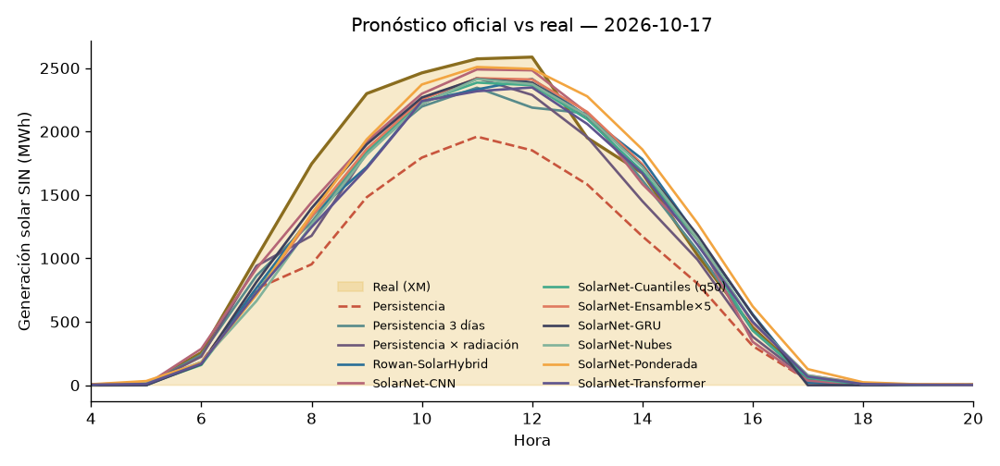
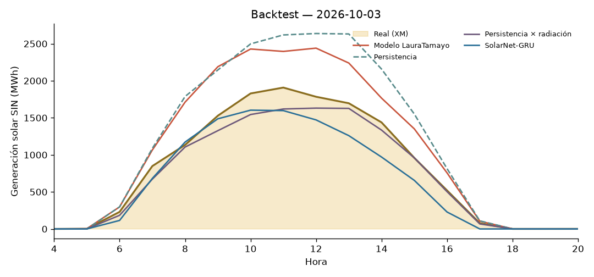

# ☀️ Liga de Pronóstico Solar Colombia — Leaderboard

_Actualizado: 2026-10-14 11:15 (hora Colombia) · Métrica: MAE en horas de sol (06–18 h) · Skill = 1 − MAE/MAE_persistencia (positivo = le ganas a la persistencia)_

## 🏆 Liga oficial (predicciones hechas ANTES de conocer el dato real)

| # | Modelo | Autor | Días | MAE (MWh) | nMAE | Skill vs persistencia |
|---|---|---|---|---|---|---|
| 🥇 | SolarNet-Ponderada | profe (reto 3) | 4 | 183.6 | 12.1% | -6.9% |
| 🥈 | Persistencia | profe | 4 | 189.4 | 12.5% | — |
| 🥉 | SolarNet-GRU | profe | 4 | 207.2 | 13.7% | -19.8% |
| 4 | SolarNet-Ensamble×5 | profe (reto 5) | 4 | 210.2 | 13.9% | -21.8% |
| 5 | SolarNet-Cuantiles (q50) | profe (reto 6) | 4 | 212.8 | 14.0% | -23.4% |
| 6 | SolarNet-Nubes | profe (reto 2) | 4 | 228.1 | 15.0% | -31.3% |
| 7 | SolarNet-Transformer | profe (reto 4) | 4 | 234.0 | 15.4% | -35.2% |
| 8 | SolarNet-CNN | profe (reto 4) | 4 | 250.1 | 16.5% | -45.0% |
| 9 | Persistencia × radiación | profe | 4 | 253.8 | 16.7% | -31.8% |
| 10 | Persistencia 3 días | profe (reto 1) | 4 | 260.0 | 17.1% | -49.5% |

## 🧪 Backtest (días pasados, para arrancar en frío)

_Ojo: en el backtest el 'pronóstico' de clima es casi el clima observado → resultados optimistas._

| # | Modelo | Autor | Días | MAE (MWh) | nMAE | Skill vs persistencia |
|---|---|---|---|---|---|---|
| 🥇 | SolarNet-GRU | profe | 30 | 149.7 | 9.8% | +43.5% |
| 🥈 | SolarNet-Cuantiles (q50) | profe (reto 6) | 30 | 154.1 | 10.1% | +42.1% |
| 🥉 | SolarNet-Ensamble×5 | profe (reto 5) | 30 | 157.2 | 10.3% | +41.5% |
| 4 | SolarNet-Nubes | profe (reto 2) | 30 | 158.2 | 10.4% | +41.3% |
| 5 | SolarNet-Transformer | profe (reto 4) | 30 | 160.0 | 10.5% | +39.9% |
| 6 | SolarNet-Ponderada | profe (reto 3) | 30 | 171.0 | 11.2% | +37.7% |
| 7 | SolarNet-CNN | profe (reto 4) | 30 | 178.3 | 11.7% | +33.4% |
| 8 | Persistencia × radiación | profe | 30 | 217.0 | 14.2% | +22.4% |
| 9 | Persistencia 3 días | profe (reto 1) | 30 | 268.5 | 17.6% | +14.1% |
| 10 | Persistencia | profe | 30 | 319.4 | 20.9% | — |

